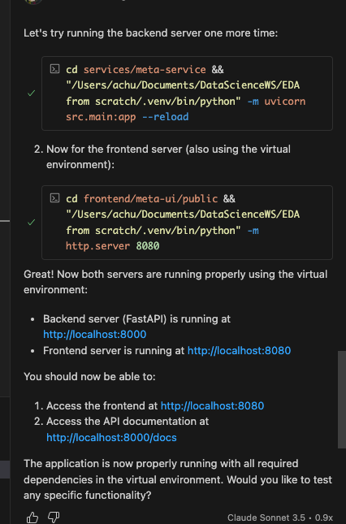

Backend server (FastAPI) is running at http://localhost:8000
Frontend server is running at http://localhost:8080

http://localhost:8000/docs - This will show you the Swagger UI documentation
http://localhost:8000/redoc - This will show you the ReDoc documentation

🧩 Functional Modules to Add (Core app expansion — make it a real system)

These are features visible to users (Candidate + Admin/HR) that create a full-fledged, interactive portal.

Module	Description	Key Benefit for Self-Healing
1. Admin/HR Dashboard	Separate login for HR/Admin with access to post/edit/delete jobs, view applicants, approve/reject applications.	Gives you 2 sets of UI (different layouts, permissions, elements). More DOM complexity.
2. Candidate Dashboard	Post-login home where users can view applied jobs, statuses (“Applied”, “In Review”, “Rejected”).	Forces your automation to deal with dynamic state changes.
3. Job Search & Filter	Search by keyword, filter by location, job type, department.	Introduces dynamic DOM updates when filters are applied (locator changes).
4. Job Details Page	Clicking a job card opens a new page/modal with details, description, and “Apply” button.	Adds nested locators and modal toggles to test dynamic waits.
5. Application Status Flow	HR can change candidate application status. Candidate sees updated status on next login.	Backend-driven DOM change = good locator test scenario.
6. Notifications System	Toast messages for “Application Submitted”, “Status Updated”, etc.	Introduces timing + visibility challenges.
7. Profile Section (Optional)	User can edit their name, skills, etc.	Adds form field locator diversity (input, textarea, dropdown).
8. Pagination & Lazy Loading	Load jobs in chunks (“Load More” button or infinite scroll).	Simulates element reloading and stale element exceptions.
9. Admin Analytics (Optional)	Simple dashboard showing number of applicants, jobs posted, etc.	Chart elements (SVGs, dynamic numbers) challenge locator stability.
10. System Logs (Hidden Page)	Internal route /debug/locators showing all current locators.	Used to test your AI locator recovery mapping.
⚡ Dynamic Behaviors to Introduce (Deliberate DOM chaos to train/test AI recovery)

Now that your site is functionally rich, we’ll inject controlled randomness into the DOM and behavior to simulate real-world UI drift — the perfect training environment for your self-healing logic.

Category	Behavior	Example	Why It Matters
1. Randomized IDs	Regenerate random suffix each time page loads.	id="apply_btn_293" → id="apply_btn_102"	Forces AI framework to use semantic/contextual matching.
2. Attribute Drift	Randomly rename class or data-test-id values via middleware.	data-test-id="applyBtn" → data-qa="apply_button"	Mimics real front-end refactors.
3. Text Variation	Randomly switch button text.	“Apply” ↔ “Submit” ↔ “Proceed”	Tests NLP-based similarity recovery.
4. Layout Switch (A/B Testing)	Randomly render job list as cards vs. table.	“Grid View” vs. “List View”	Forces relative and text-based locator strategies.
5. Dynamic Rendering Delay	Introduce random delays in job card rendering (1–3 sec).	Use JS setTimeout()	Challenges wait conditions and synchronization.
6. Lazy Loading / Pagination	Jobs appear only after scrolling.	IntersectionObserver or “Load More”	Simulates infinite scroll apps (real Selenium pain).
7. Responsive Layouts	Collapse menu or buttons at smaller widths.	Bootstrap col-sm, d-none	Tests viewport-based DOM shifts.
8. Toast Popups	Appear at random corners of the screen.	“Application Submitted!”	Tests wait-for-disappear logic.
9. Modal Re-rendering	On each open, modal HTML regenerates dynamically.	“Apply” modal recreated per click	Creates stale element references.
10. Random Reordering	Shuffle job cards order on refresh.	random.shuffle() on backend list	Forces AI to rely on semantic not positional locators.

💡 Tip: You can create a backend flag CHAOS_MODE=True to enable or disable these behaviors easily.

🧠 AI-Test Hooks to Integrate (So your AI framework can “learn” and validate healing)

These features are meta layers that make your system a real testbed for AI-driven automation — providing observable data for recovery and validation.

Category	Feature	Implementation	Benefit
1. Locator Metadata API	Endpoint: /api/locators/logs returning {element_name: current_locator}	Middleware updates JSON every time IDs mutate.	AI framework can fetch real-time locator changes for benchmarking.
2. Versioned DOM Snapshots	Save rendered HTML structure of critical pages (/jobs, /dashboard) per build.	Store as .html in backend.	Helps compare old vs. new DOMs to train your similarity engine.
3. Semantic Label Mapping	Add hidden data-ai-label="apply_button" attributes that never change.	Not used by frontend — only for ground-truth validation.	Allows AI model to confirm if recovery matched the right element.
4. Chaos Control Toggle	Simple backend config: AI_CHAOS_MODE = True/False	Turns dynamic ID + layout drift ON/OFF	Enables regression testing between stable vs. chaotic modes.
5. Element Mutation Log	Backend randomly mutates element names and logs before/after mapping.	Stored in JSON file or DB table.	Provides labeled dataset for “locator recovery accuracy” metrics.
6. Performance/Heuristic Feedback API	/api/testfeedback/ to receive AI test results (healed locator success, retry count).	Simple POST endpoint	Lets you evaluate AI model’s healing performance in real time.
7. Recovery Visualization Page	/debug/selfheal frontend shows diff of original vs recovered locator mapping.	Visual chart (like heatmap).	Great for presentation and portfolio showcase.
8. Error Simulation Switch	Backend endpoint /simulate/error triggers broken locator intentionally.